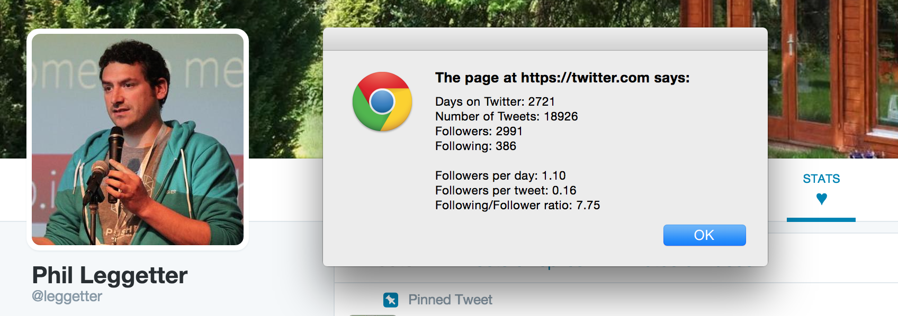

# Twitter Vanity Stats User Script

A User Script for use with things like Tampermonkey to show some Twitter profile vanity stats.

In v0.1 it creates a "Stats &hearts" menu item that will `alert` some vanity stats when clicked.

## Installation

If you have [Tampermonkey](http://tampermonkey.net/) installed you can install this via [Twitter Vanity Stats on OpenUserJS](https://openuserjs.org/scripts/leggetter/Twitter_Vanity_Stats).

## Motivation

This is obvious really rudimentary, but as I approached a Twitter milestone I thought I'd hack together a little script to give some very basic stats.
